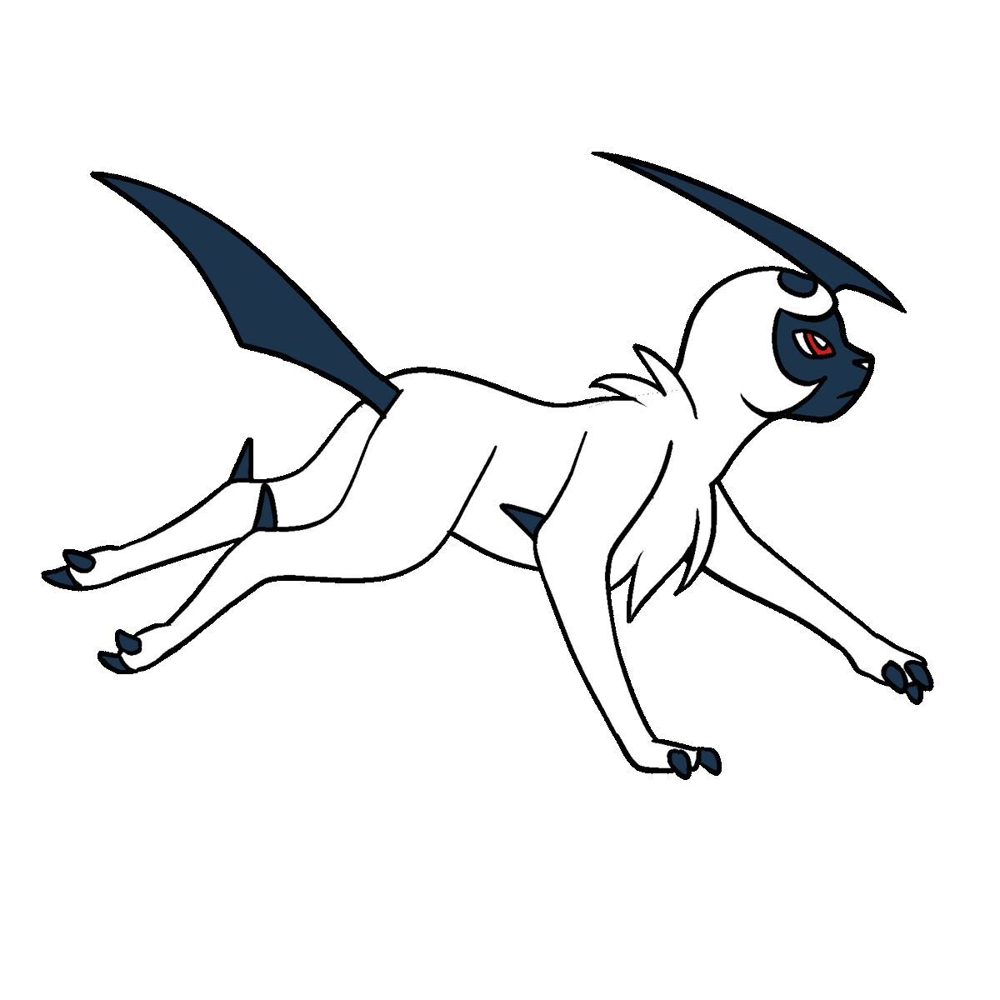
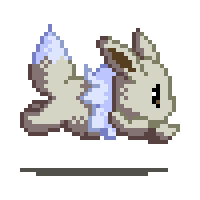
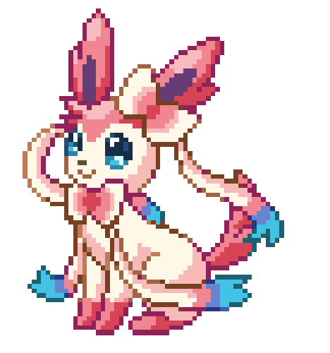

  
<pre>
       💻 MSc in Computer Science @IST 
       🌿 Game Dev • Cybersecurity • Distributed Systems
       🧡 Software Engineer Intern @Cloudflare
       ✨ Code • CTFs • Space Exploration
       🧊 <a href="https://github.com/GameDevTecnico/cubos">Cubos Game Engine</a> • 🛰️ IST NanoSat lab 
       📖 <a href="https://github.com/vvcogo/java-longfastbloomfilter/tree/dev">BloomFilter research</a>
       🎮 Music • Games • Anime • 🐾 Doggies
</pre>
       

 

---

  

    

      
      
        
      

       
      

     

-------

   

<pre>

   
• Programming Languages •
   

• Data Bases •
   

   
• Games •
   

• Others •

</pre>

  

<pre>
    .o88o.                               o8o                .
    888 `"                               `"'              .o8
   o888oo   .oooo.o  .ooooo.   .ooooo.  oooo   .ooooo.  .o888oo oooo    ooo
    888    d88(  "8 d88' `88b d88' `"Y8 `888  d88' `88b   888    `88.  .8'
    888    `"Y88b.  888   888 888        888  888ooo888   888     `88..8'
    888    o.  )88b 888   888 888   .o8  888  888    .o   888 .    `888'
   o888o   8""888P' `Y8bod8P' `Y8bod8P' o888o `Y8bod8P'   "888"      d8'
                                                                .o...P'
                                                                `XER0'
</pre>
Bpmg tmnb i umaaiom pqllmv epmzm vw wvm lizma bw twws. Lmkwlm bpm aqovit ib sccsqbmvapq.oqbpcj.qw/zml-epmmtjizzwe, qb’a bpm wvtg smg xiab bpm nqzmeitt. Bqum’a zcvvqvo wcb

 
